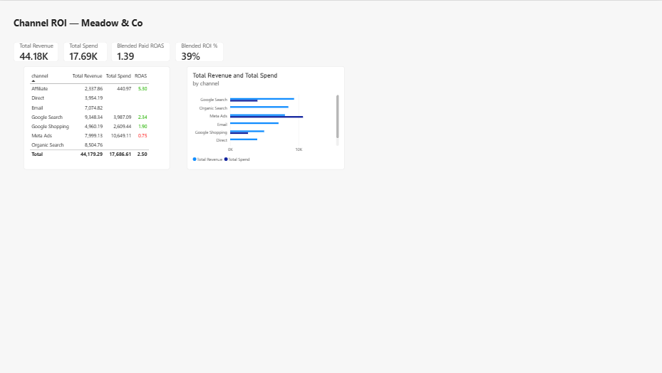
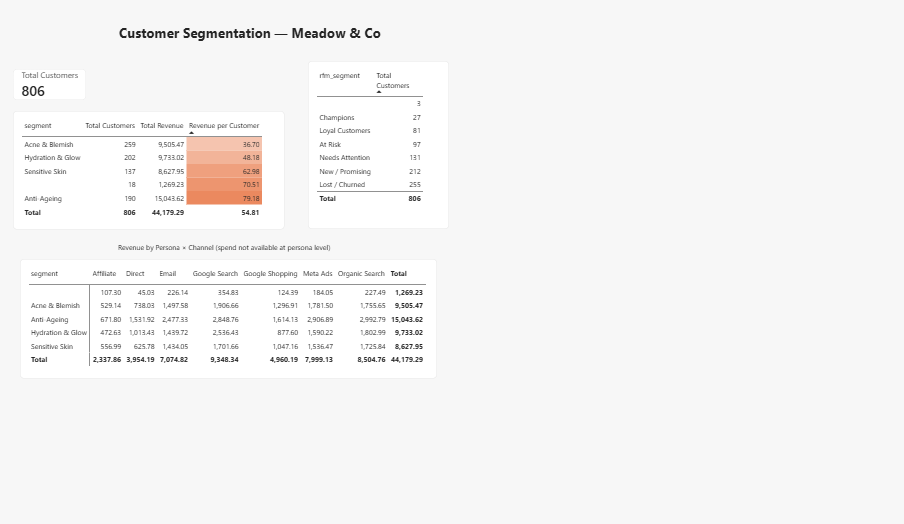
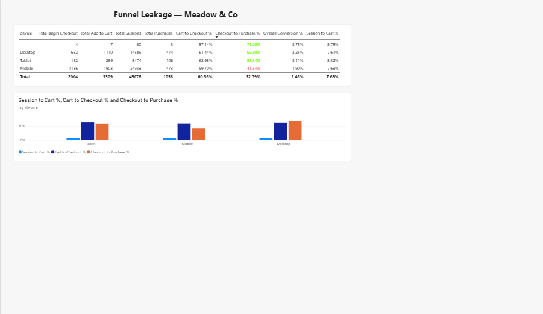
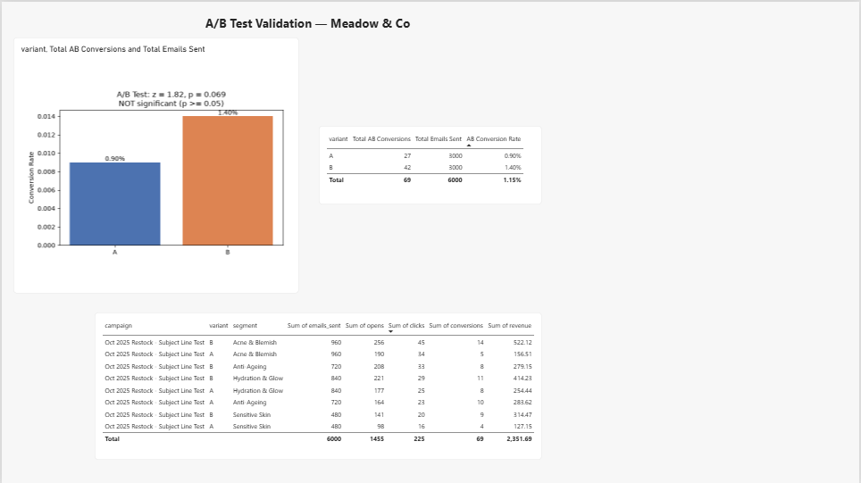
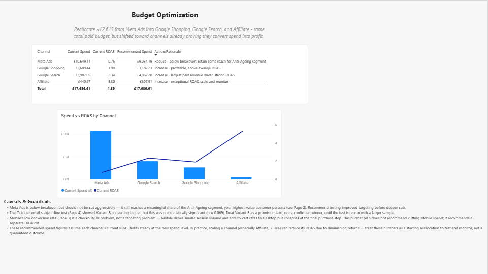

# Meadow & Co — Marketing Analytics

End-to-end marketing analytics project for **Meadow & Co**, a simulated 3-year-old London-based Direct-to-Consumer (DTC) skincare brand. Built as a lead-analyst engagement for the Head of Growth: clean messy, siloed data from 5 sources, reconcile reporting gaps, and turn raw numbers into a data-backed budget recommendation.

## Business Problem

Marketing spend has climbed significantly over 18 months (Jan 2025 – Jun 2026), but leadership lacks visibility into whether that spend is driving profitable growth or funding inefficient waste, across Google Search, Google Shopping, Meta Ads, Affiliate, Organic Search, Email, and Direct traffic.

## Business Questions Answered

1. **Channel ROI** — which channels drive profitable growth vs. buy empty conversions?
2. **Customer Segmentation** — which customer personas are most valuable, and does ad spend align with them?
3. **Funnel Leakage** — where do users drop off (Sessions → Cart → Checkout → Purchase), and how does this differ by device?
4. **A/B Test Validation** — did October's restock email subject-line variant win due to a real lift, or random noise?
5. **Budget Optimization** — how should next quarter's channel budget be reallocated?

## Tools & Skills

Excel (XLOOKUP, PivotTables) · MySQL (data cleaning, view-based data modeling, star schema design) · Power BI (data modeling, DAX, 5-page interactive report) · Python (two-proportion z-test for statistical significance, embedded directly in Power BI) · Statistical hypothesis testing · Marketing analytics (ROAS, ROI, RFM segmentation, funnel analysis, budget allocation)

## Methodology

This project mirrors how a real analytics workflow scales with data volume, rather than jumping straight to the most advanced tool:

1. **Excel** — first-pass cleaning on the raw marketing spend data: `XLOOKUP` against a channel-mapping table to standardise inconsistent channel names (`Meta_Ads`, `meta ads`, `FB/IG Ads` → `Meta Ads`), currency-string parsing, duplicate-row detection via a composite key, and a PivotTable/PivotChart summary. See [`excel/channel_spend_cleaning.xlsx`](excel/channel_spend_cleaning.xlsx).
2. **SQL (MySQL)** — the same cleaning logic, rebuilt as a proper star-schema data model once the scale (5 source tables, 40,000+ funnel rows, multi-table joins) made Excel the wrong tool for the job.
3. **Power BI** — the cleaned SQL views modeled into a 5-page interactive report with 19 DAX measures.
4. **Python** — a two-proportion z-test embedded directly in Power BI to statistically validate the A/B test result, rather than relying on a raw percentage comparison.

## Repository Structure
```
excel/ → Initial data cleaning (XLOOKUP, duplicate detection, PivotTable/PivotChart)
sql/ → MySQL scripts: staging/cleaning, production views, analysis queries
powerbi/ → The Power BI report file (.pbix)
screenshots/ → Static images of all 5 report pages
docs/ → 1-page executive summary (recruiter-facing)
```


## Key Findings

**Channel ROI:** Blended paid ROAS across all channels is **1.39** (£44,179 total revenue on £17,687 paid spend). Affiliate is the standout performer (ROAS 5.30) despite the smallest budget; Meta Ads is below breakeven (ROAS 0.75) despite being the largest spend line.

**Customer Segmentation:** Anti-Ageing customers are worth **£79.18/customer** — more than double Acne & Blemish (£36.70/customer) — despite Acne & Blemish having the largest customer base. Meta Ads, despite its poor overall ROAS, delivers a meaningful share of revenue from this highest-value persona — meaning a blanket "cut Meta Ads" recommendation would be too simplistic.

**Funnel Leakage:** Mobile and Desktop behave almost identically through Add-to-Cart and Checkout, but Mobile's Checkout→Purchase rate (41.6%) is nearly 28 percentage points behind Desktop's (69.5%) — pointing to a mobile checkout UX issue, not a targeting problem.

**A/B Test Validation:** October's email subject-line Variant B looked 56% better on raw conversion rate, but a two-proportion z-test returned **p = 0.069** — not statistically significant at the standard 0.05 threshold. Recommendation: extend the test before declaring a winner, rather than act on a number that could be random noise.

**Budget Optimization:** Recommended reallocating ~£2,615 from Meta Ads into Google Shopping, Google Search, and Affiliate — same total budget, shifted toward channels already proving they convert spend into profit.

## Report Pages

### 1. Channel ROI


### 2. Customer Segmentation


### 3. Funnel Leakage


### 4. A/B Test Validation


### 5. Budget Optimization


## Executive Summary

A 1-page, recruiter-facing summary of the business problem, approach, and recommendations is available in [`docs/executive_summary.docx`](docs/executive_summary.docx).

## Author

**Saud Qureshi** — MSc Digital Marketing
[LinkedIn](https://www.linkedin.com/in/saudqureshi2711/) · [Portfolio](https://www.saudqureshi.com/)